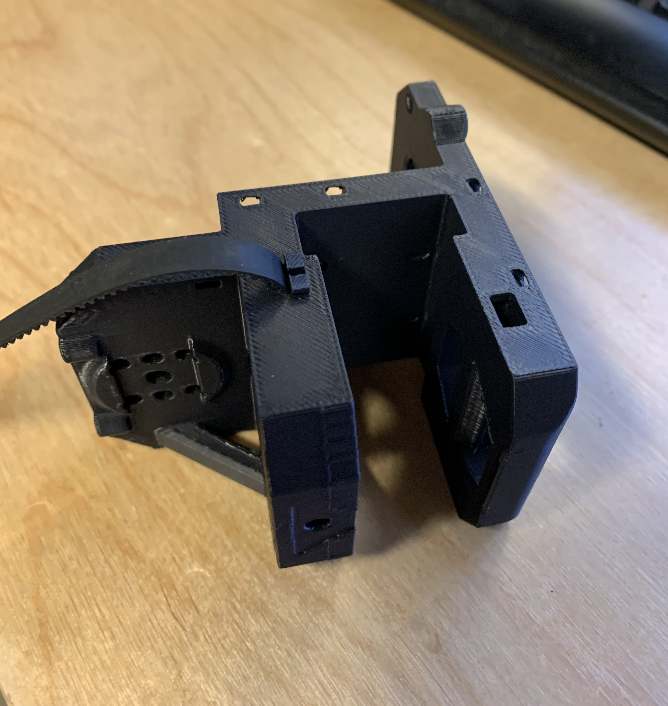
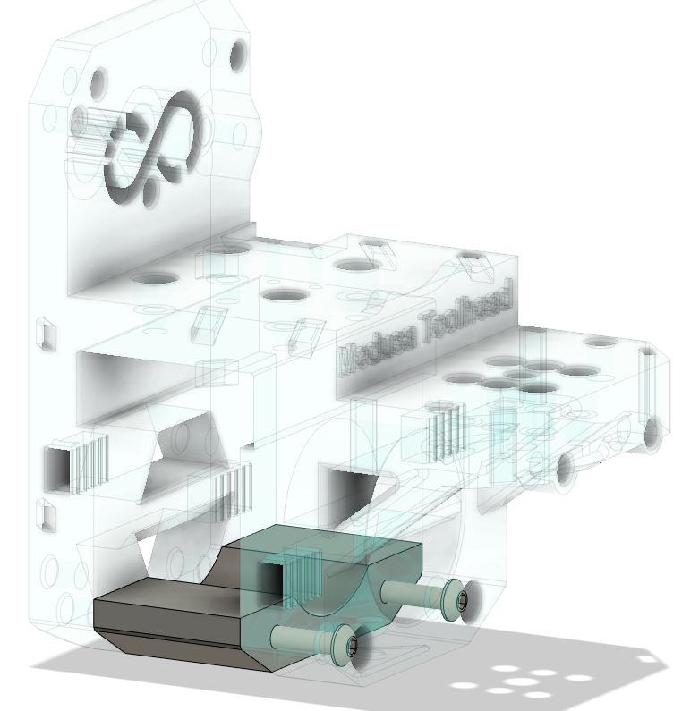
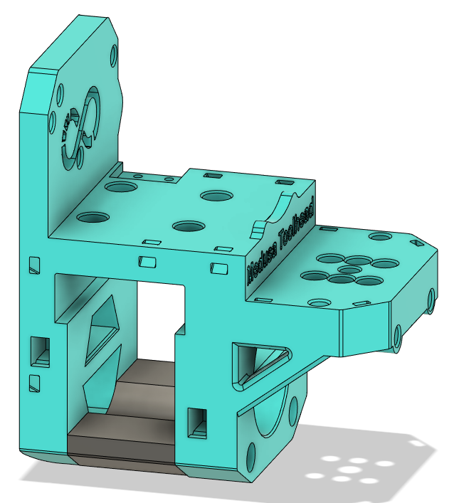
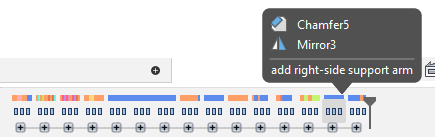

# Medusa-Toolhead (Apex Mod)

This project adds several features to [Ch4rlesB's Medusa Toolhead](https://github.com/Ch4rlesB/Medusa-Toolhead/tree/main).

- **New clip-in belt mount design** which eventually became its own project under [Apex Clips](https://github.com/ApexArray/ApexClips)
- **Bottom support brace**
- Added support for ebb36 toolhead board (keeps original support for umbilical and Hartk board)
- Lowered X endstop so that it activates against the Y carriage block (removes need for endstop flag)
- Strengthened zip tie slots
- Added right-side support arm (print with supports in slicer)
- Resized heat insert slots from 3.9D -> 3.8D

https://github.com/ApexArray/Medusa-Toolhead/assets/91706106/2dc37877-ce4a-4b54-b629-3e299c2d5c1f

New files are under the ./Apex_Mod folder:
- [STLs](./Apex_Mod/stls/)
- [CAD](./Apex_Mod/CAD/)

All other STLs (not modified by me) can be found in the original [./stls](./stls) directory

## Apex Clips

This solution is designed to be:
- Light-weight
- Strong
- Semi-toolless
- Easy to assemble

Insert the belt into the cavity, and slide in a printable clip to hold it in place.

https://github.com/ApexArray/Medusa-Toolhead/assets/91706106/179e2e59-fea6-49be-8833-3ce2743f321f

**Installation tip:** The two front clips sit between the belt and X gantry, and might be difficult to install if you have big fingers. I use a screwdriver or thin wrench to keep the clip aligned while sliding it into the cavity.

## Bottom support block

The original toolhead has excessive Y wobble during fast printing. The fan duct provides some support, but the duct itself is cantilevered from the back and seemed to result in a "diving board" board effect.

The block is attached using two m3x35mm screws and reinforces the front of the toolhead to mitigate any bouncing/wobbling.

While this does seem to be more rigid, I don't have empirical results at the moment as my X rail seems to have developed wobble some time in between testing.

## CAD

I tried to keep a tidy f360 timeline on this project. With some exceptions, most features are contained in their own group and labeled accordingly. You should be able to delete/change most features without affecting the rest of the model.

## BOM

Uses the same hardware from the original project, plus:
- 2x m3x35mm screws (bottom support block)
- +2 heat inserts (bottom support block)
- +2 heat inserts (for ebb36 + hartk/umbilical support)

## TODO

- Further input shaper testing (with and without bottom support block)
- Reinforce as needed to strengthen Y movement (potentially reinforce further using longer m3x40mm screws for the hotend fan)
- Additional probe options (e.g., BLTouch, Cargogropher), as the current klicky implementation has a very large Y offset and cannot probe the front portion of the bed.

## LICENSE
All files released under the same [GNU General Public License v3.0](./LICENSE) as the original project.
